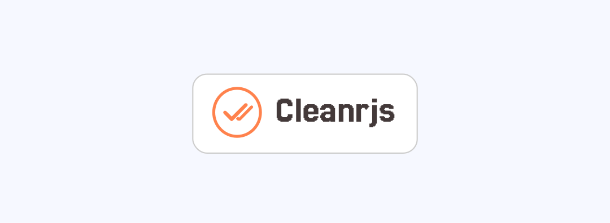

# Cleanrjs

[![MIT License][license-image]][license] [![NPM version][npm-version-image]][npm-url] 



A minimal Javascript validation and masking library

## ✨ Features

- ✅ Simple and intuitive validation methods
- 🌍 Country-specific regex rules (e.g. India, UK, US, etc.)
- ⚙️ Supports custom regex overrides
- 🔁 Dynamic reinitialization via `reinit()`

## 📦 Installation

Using **npm**:
```bash
npm install cleanrjs
```

## 🧩 Basic Usage

The main validation entry point is Cleanr.validate, which provides simple boolean-based validation methods for different data types.
```js
import Cleanr from 'cleanrjs';
```
```js
Cleanr.validate.email('user@example.com');       // true
Cleanr.validate.email('invalid!email.com');      // false
```
```js
Cleanr.validate.phone('+91-9876543210');         // true
Cleanr.validate.phone('12345');                  // false
```
```js
Cleanr.validate.password('Str0ngPass!');         // true
Cleanr.validate.password('easypassword');        // false
```
```js
Cleanr.validate.username('michael_scott');       // true
```
```js
Cleanr.validate.postalCode('560001');            // true
```
```js
Cleanr.validate.url('https://example.com');      // true
```

and more...

## ⚙️ Reinitialize with Custom Options

You can override default regex rules or switch countries at runtime using reinit().
```js
Cleanr.reinit({
  country: 'ca', // Switch to Canada
  overrideRegex: {
    phone: /^[2-9]\d{9}$/, // Custom phone rule
  },
});
```

You can also add a new regex rule while ```reinit``` by adding a new key-value pair to the ```overrideRegex```.

More yet to come.

![Cleanrjs][cleanrjs-image] ![Aim][cleanrjs-moto-image]

[license-image]: https://img.shields.io/badge/license-MIT-blue.svg
[license]: LICENSE.md

[npm-url]: https://npmjs.org/package/cleanrjs
[npm-version-image]: https://badge.fury.io/js/cleanrjs.svg

[cleanrjs-image]: https://img.shields.io/badge/Cleanrjs-orange.svg
[cleanrjs-moto-image]: https://img.shields.io/badge/Aiming%20to%20keep%20your%20input%20validation%20sharp%20and%20simple-blue.svg
